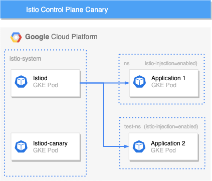
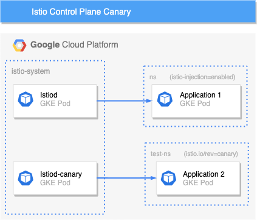
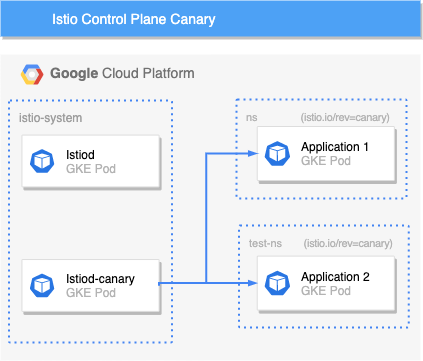

<!--truncate-->

Co-author: Omar Steitieh


## Overview

A new feature to support canary deployments of the Control Plane was included in Istio version 1.5.x. This blog aims to demonstrate this feature, The steps below assume you have version 1.6+ installed and running in your cluster.

An introduction to deployment strategies; blue-green, canary and more can be found [here](https://dev.to/mostlyjason/intro-to-deployment-strategies-blue-green-canary-and-more-3a3)

Istio service mesh has two main components; Control Plane & Data Plane

### Control Plane

The Control Plane is responsible for service discovery, routing configuration, providing service-to-service, and end-user authentication. It also allows secure mTLS communication in the data plane by maintaining a CA and generating certificates. Since 1.5.x, the control plane components have been consolidated into a single service called istiod.

### Data Plane

The Data Plane consists of Envoy proxies deployed as sidecars to every Istio enabled pod in the cluster. They intercept any incoming or outgoing requests from the main container in the pod for two purposes; firstly they provide encryption, controlling the communication between pods and secondly they provide telemetry on all network traffic.

We will deploy a second Istio control plane which will be used to canary traffic in a namespace.

## Getting Started

### Control Plane

You currently have an existing Istio control plane running. To deploy a canary control plane you must set the revision field. This can be done either using the istioctl CLI tool installation method or via using the istio-operator.

istioctl example:

```bash
istioctl install --set revision=canary
```

When installing Istio using istioctl the default profile will be applied automatically unless otherwise specified, to use a custom profile our preferred method is to deploy using the IstioOperator resource. Pre-configured profiles can be viewed [here](https://istio.io/latest/docs/setup/additional-setup/config-profiles/).

istio-operator example:

```yaml
apiVersion: install.istio.io/v1alpha1
kind: IstioOperator
metadata:
  name: istio-canary
  namespace: istio-system
spec:
  ...
  revision: canary
  ...
```

Note: IstioOperator available options can be viewed [here](https://istio.io/latest/docs/reference/config/istio.operator.v1alpha1/)

Once applied a second control plane will be created. Both the existing and the canary revision will be running in the cluster.

```bash
NAME                           READY   STATUS    RESTARTS  AGE
istiod-7f7d5496cf-ltff2         1/1    Running   0        5m45s
istiod-canary-7f7d5496cf-ltff2  1/1    Running   0          15s
```

When the canary istiod pod is running it’s worth mentioning that both the `ingress` and `egress` gateway pods will upgrade to the new version and old pods will be terminated — this was surprising as now all the data plane proxies within the cluster do not have version parity. Consequently, it is **highly** recommended to check changelogs between versions!

### Data Plane

Creating a canary control plane has no impact on the data plane. To roll out your sidecar `istio-proxy` updates to the new version of the control plane take the following steps.

<p align="center">
  </img>
</p>

Remove the existing namespace label `istio-injection` and add a new label `istio.io/rev=canary`.

This can be done with the following command:

```bash
kubectl label namespace <namespace> istio-injection- istio.io/rev=canary
```

*Note: The `istio-injection` label must be removed because it takes precedence over the `istio.io/rev` label for backward compatibility.*

After the namespace labels have been updated you will need to restart the pods to trigger re-injection:

```bash
kubectl rollout restart deployment -n <namespace>
```

Once the pods have been recreated they will be configured to point to the new canary Istio control plane.

<p align="center">
  </img>
</p>

Confirm the pods are now using the canary revision of the Istio control plane by running this command against one of the restarted pods:

```bash
istioctl proxy-config endpoints <pod>.<namespace> --cluster xds-grpc -ojson | grep hostname
```

Expected output:

```bash
“hostname”: “istiod-canary.istio-system.svc”
```

<p align="center">
  </img>
</p>

After successfully testing the new control plane version continue to roll out the upgrade to the remainder of the cluster workloads using the same approach.

## Summary

Points to consider when choosing to use Istio canary releases using revisions:

**Promoting the canary release** — We recommend using the version as the revision. This keeps each namespace with an explicit label of the control plane version being used.

**Potential downtime** — Consideration for the ingress and egress gateways must be taken into account. Possible version disparity between istio-proxy sidecars could introduce breaking changes that impact proxy traffic and would require a re-deployment of the previous control plane.

**Validating revision before adoption** — Restarting all pods in a namespace may cause a large impact if something goes wrong. Consider scaling the deployments instead to test new pods communicating to the new control plane revision.

*Note: Everything in this article was tested using Istio 1.6.5 running on our Raspberry Pi Kubernetes cluster built using the [Raspbernetes project](https://github.com/raspbernetes).*
